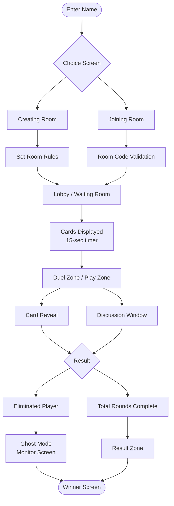

# Screen 1 — Overall App Flow

```mermaid
flowchart TD
    A([Enter Name]) --> B{Choice Screen}
    B --> C[Creating Room]
    B --> D[Joining Room]
    C --> E[Set Room Rules]
    D --> F[Room Code Validation]
    E --> G[Lobby / Waiting Room]
    F --> G
    G --> H[Cards Displayed\n15-sec timer]
    H --> I[Duel Zone / Play Zone]
    I --> J[Card Reveal]
    I --> K[Discussion Window]
    J --> L{Result}
    K --> L
    L --> M[Eliminated Player]
    L --> N[Total Rounds Complete]
    M --> O[Ghost Mode\nMonitor Screen]
    N --> P[Result Zone]
    O --> Q([Winner Screen])
    P --> Q
```
