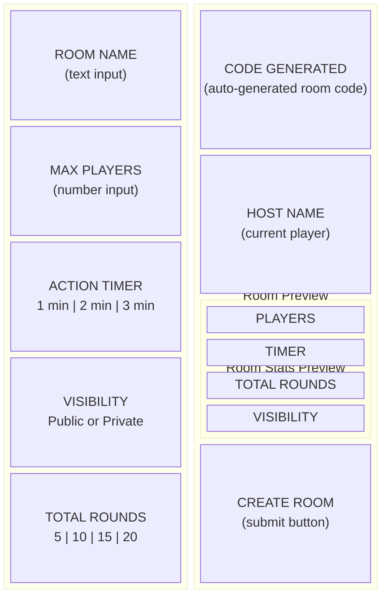

# Screen 2 — Create Room

```mermaid
block-beta
  columns 2

  block:LEFT["Settings Panel"]:1
    columns 1
    RoomName["ROOM NAME\n(text input)"]
    MaxPlayers["MAX PLAYERS\n(number input)"]
    ActionTimer["ACTION TIMER\n1 min | 2 min | 3 min"]
    Visibility["VISIBILITY\nPublic or Private"]
    TotalRounds["TOTAL ROUNDS\n5 | 10 | 15 | 20"]
  end

  block:RIGHT["Room Preview"]:1
    columns 1
    CodeGenerated["CODE GENERATED\n(auto-generated room code)"]
    HostName["HOST NAME\n(current player)"]
    block:PreviewStats["Room Stats Preview"]:1
      columns 1
      PreviewPlayers["PLAYERS"]
      PreviewTimer["TIMER"]
      PreviewRounds["TOTAL ROUNDS"]
      PreviewVisibility["VISIBILITY"]
    end
    CreateBtn["CREATE ROOM\n(submit button)"]
  end
```
