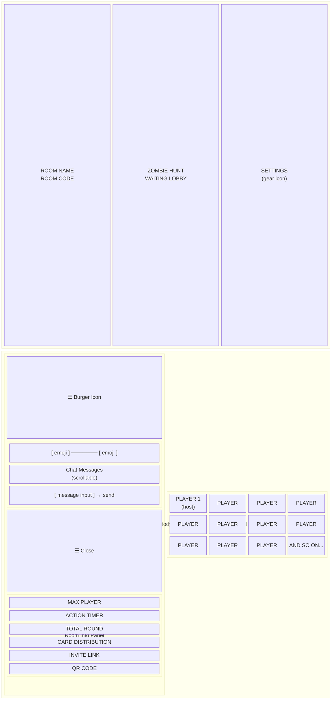

# Screen 3 — Waiting Lobby

```mermaid
block-beta
  columns 1

  block:TopBar["Top Bar"]:1
    columns 3
    RoomInfo["ROOM NAME\nROOM CODE"]
    Title["ZOMBIE HUNT\nWAITING LOBBY"]
    Settings["SETTINGS\n(gear icon)"]
  end

  block:Body["Body"]:1
    columns 2

    block:LeftPanel["Left Sidebar"]:1
      columns 1
      BurgerIcon["☰ Burger Icon"]
      block:CommsPanel["COMMS Panel"]:1
        columns 1
        EmojiRow["[ emoji ] ─────── [ emoji ]"]
        ChatArea["Chat Messages\n(scrollable)"]
        ChatInput["[ message input ] → send"]
      end
      BurgerClose["☰ Close"]
      block:RoomInfoPanel["Room Info Panel"]:1
        columns 1
        MaxPlayer["MAX PLAYER"]
        ActionTimer["ACTION TIMER"]
        TotalRound["TOTAL ROUND"]
        CardDist["CARD DISTRIBUTION"]
        InviteLink["INVITE LINK"]
        QRCode["QR CODE"]
      end
    end

    block:PlayerGrid["Player Grid (scrollable)"]:1
      columns 4
      P1["PLAYER 1\n(host)"]
      P2["PLAYER"]
      P3["PLAYER"]
      P4["PLAYER"]
      P5["PLAYER"]
      P6["PLAYER"]
      P7["PLAYER"]
      P8["PLAYER"]
      P9["PLAYER"]
      P10["PLAYER"]
      P11["PLAYER"]
      P12["AND SO ON..."]
    end
  end
```
