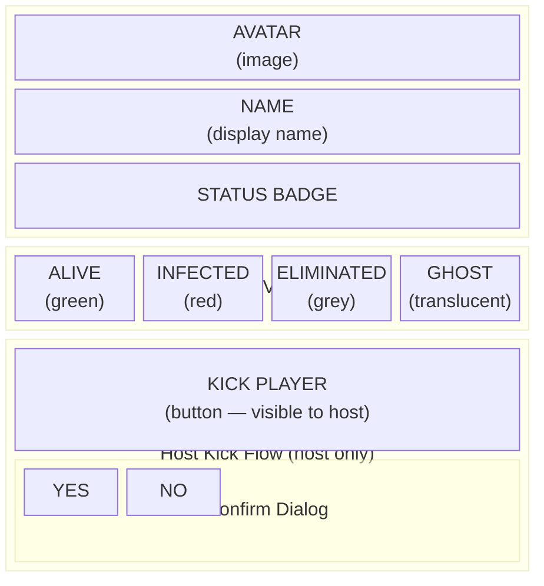

# Screen 4 — Name Card

```mermaid
block-beta
  columns 1

  block:Card["Player Name Card (140×170px)"]:1
    columns 1
    Avatar["AVATAR\n(image)"]
    Name["NAME\n(display name)"]
    Status["STATUS BADGE"]
  end

  block:StatusVariants["Status Variants"]:1
    columns 4
    S1["ALIVE\n(green)"]
    S2["INFECTED\n(red)"]
    S3["ELIMINATED\n(grey)"]
    S4["GHOST\n(translucent)"]
  end

  block:KickFlow["Host Kick Flow (host only)"]:1
    columns 1
    KickBtn["KICK PLAYER\n(button — visible to host)"]
    block:Confirm["Confirm Dialog"]:1
      columns 2
      Yes["YES"]
      No["NO"]
    end
  end
```
