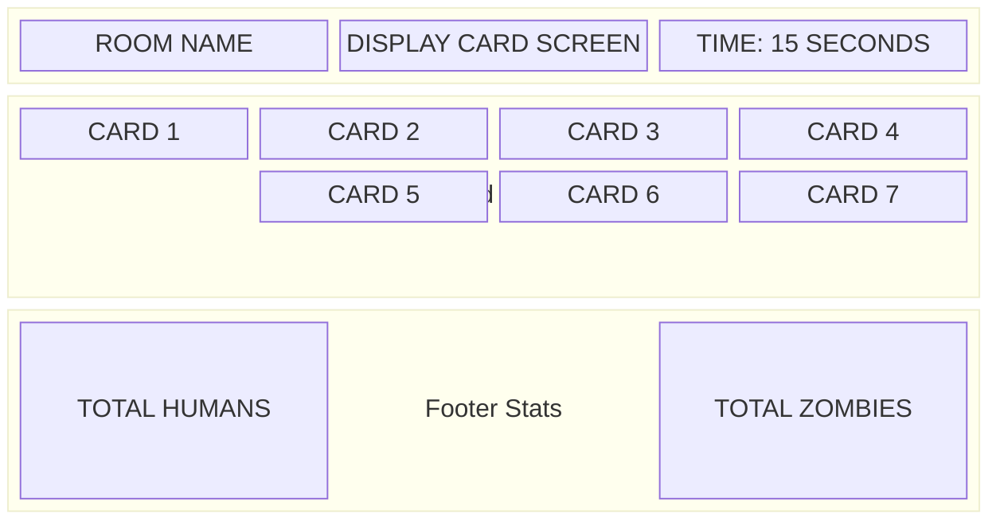

# Screen 5 — Display Card Screen

```mermaid
block-beta
  columns 1

  block:TopBar["Top Bar"]:1
    columns 3
    RoomName["ROOM NAME"]
    Title["DISPLAY CARD SCREEN"]
    Timer["TIME: 15 SECONDS"]
  end

  block:CardGrid["Card Grid"]:1
    columns 4
    C1["CARD 1"]
    C2["CARD 2"]
    C3["CARD 3"]
    C4["CARD 4"]
    space
    C5["CARD 5"]
    C6["CARD 6"]
    C7["CARD 7"]
    space
  end

  block:Footer["Footer Stats"]:1
    columns 3
    Humans["TOTAL HUMANS"]
    space
    Zombies["TOTAL ZOMBIES"]
  end
```
