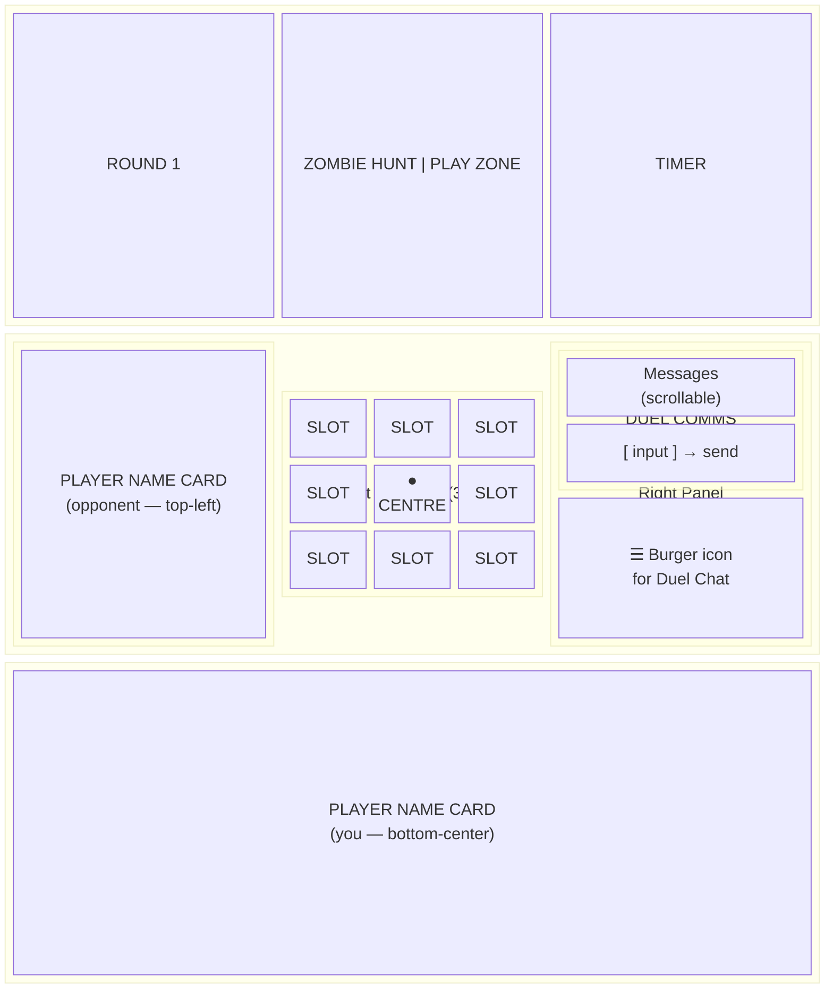

# Screen 6 — Play Zone (Duel Zone)

```mermaid
block-beta
  columns 1

  block:TopBar["Top Bar"]:1
    columns 3
    RoundBadge["ROUND 1"]
    Title["ZOMBIE HUNT | PLAY ZONE"]
    TimerBadge["TIMER"]
  end

  block:Body["Body"]:1
    columns 3

    block:OpponentArea["Opponent Side"]:1
      columns 1
      OpponentCard["PLAYER NAME CARD\n(opponent — top-left)"]
    end

    block:PlayGrid["7-Slot Play Grid (3-1-3)"]:1
      columns 3
      G1["SLOT"] G2["SLOT"] G3["SLOT"]
      G4["SLOT"] G5["●\nCENTRE"] G6["SLOT"]
      G7["SLOT"] G8["SLOT"] G9["SLOT"]
    end

    block:RightPanel["Right Panel"]:1
      columns 1
      block:DuelComms["DUEL COMMS"]:1
        columns 1
        ChatMessages["Messages\n(scrollable)"]
        ChatInput["[ input ] → send"]
      end
      BurgerIcon["☰  Burger icon\nfor Duel Chat"]
    end

  end

  block:YouArea["Your Side"]:1
    columns 1
    YouCard["PLAYER NAME CARD\n(you — bottom-center)"]
  end
```
