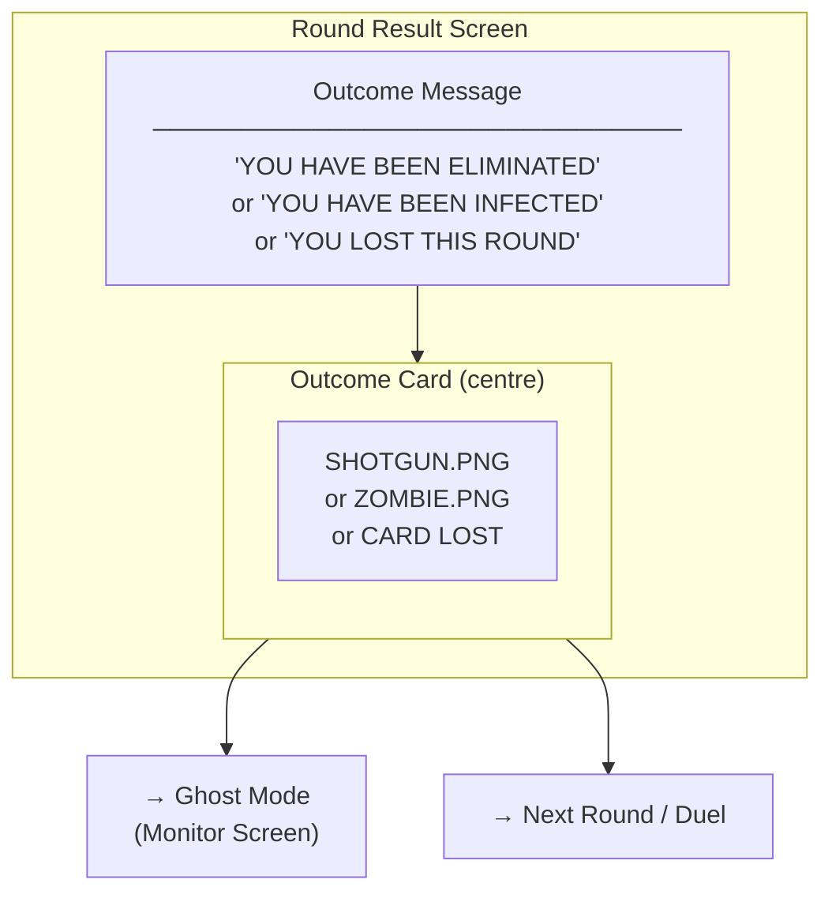

# Screen 7 — Round Result

```mermaid
flowchart TD
  subgraph ResultScreen["Round Result Screen"]
    Msg["Outcome Message\n──────────────────────────────\n'YOU HAVE BEEN ELIMINATED'\nor 'YOU HAVE BEEN INFECTED'\nor 'YOU LOST THIS ROUND'"]

    subgraph OutcomeCard["Outcome Card (centre)"]
      direction TB
      CardImg["SHOTGUN.PNG\nor ZOMBIE.PNG\nor CARD LOST"]
    end

    Msg --> OutcomeCard
  end

  OutcomeCard --> Ghost["→ Ghost Mode\n(Monitor Screen)"]
  OutcomeCard --> Next["→ Next Round / Duel"]
```
