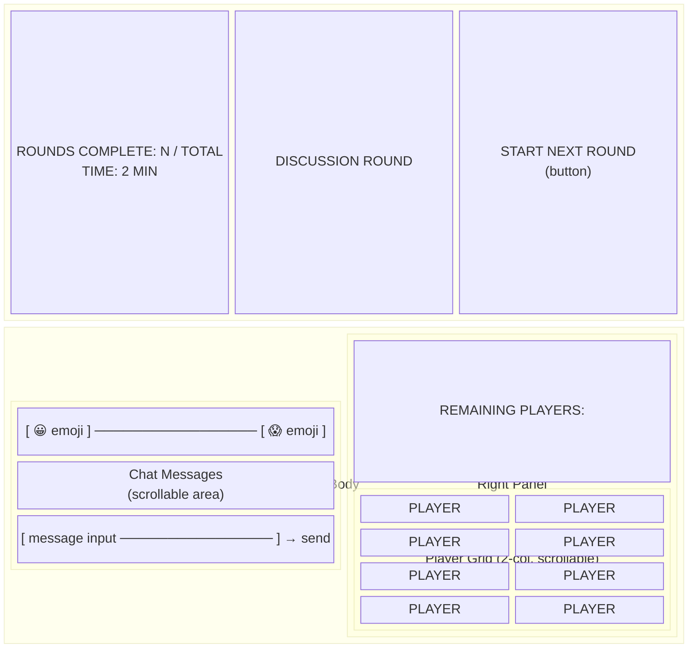

# Screen 8 — Discussion Round

```mermaid
block-beta
  columns 1

  block:TopBar["Top Bar"]:1
    columns 3
    LeftInfo["ROUNDS COMPLETE: N / TOTAL\nTIME: 2 MIN"]
    Title["DISCUSSION ROUND"]
    NextRoundBtn["START NEXT ROUND\n(button)"]
  end

  block:Body["Body"]:1
    columns 2

    block:ChatPanel["Global Chat Panel"]:1
      columns 1
      EmojiRow["[ 😀 emoji ]  ─────────────────  [ 😱 emoji ]"]
      ChatMessages["Chat Messages\n(scrollable area)"]
      ChatInput["[ message input ──────────────── ] → send"]
    end

    block:RightPanel["Right Panel"]:1
      columns 1
      Label["REMAINING PLAYERS:"]
      block:PlayerGrid["Player Grid (2-col, scrollable)"]:1
        columns 2
        P1["PLAYER"] P2["PLAYER"]
        P3["PLAYER"] P4["PLAYER"]
        P5["PLAYER"] P6["PLAYER"]
        P7["PLAYER"] P8["PLAYER"]
      end
    end

  end
```
