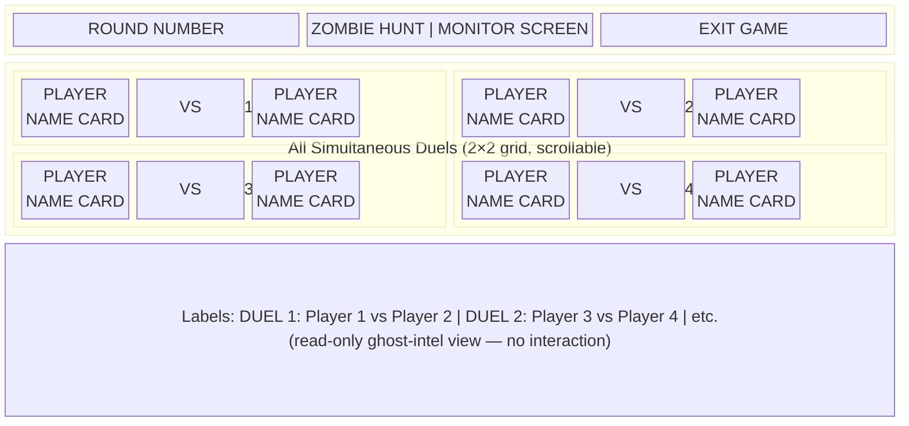

# Screen 9 — Monitor / Ghost Screen (Eliminated Player View)

```mermaid
block-beta
  columns 1

  block:TopBar["Top Bar"]:1
    columns 3
    RoundBadge["ROUND NUMBER"]
    Title["ZOMBIE HUNT | MONITOR SCREEN"]
    ExitBtn["EXIT GAME"]
  end

  block:DuelGrid["All Simultaneous Duels (2×2 grid, scrollable)"]:1
    columns 2

    block:Duel1["Duel 1"]:1
      columns 3
      D1P1["PLAYER\nNAME CARD"]
      D1VS["VS"]
      D1P2["PLAYER\nNAME CARD"]
    end

    block:Duel2["Duel 2"]:1
      columns 3
      D2P1["PLAYER\nNAME CARD"]
      D2VS["VS"]
      D2P2["PLAYER\nNAME CARD"]
    end

    block:Duel3["Duel 3"]:1
      columns 3
      D3P1["PLAYER\nNAME CARD"]
      D3VS["VS"]
      D3P2["PLAYER\nNAME CARD"]
    end

    block:Duel4["Duel 4"]:1
      columns 3
      D4P1["PLAYER\nNAME CARD"]
      D4VS["VS"]
      D4P2["PLAYER\nNAME CARD"]
    end

  end

  Note["Labels: DUEL 1: Player 1 vs Player 2 | DUEL 2: Player 3 vs Player 4 | etc.\n(read-only ghost-intel view — no interaction)"]
```
