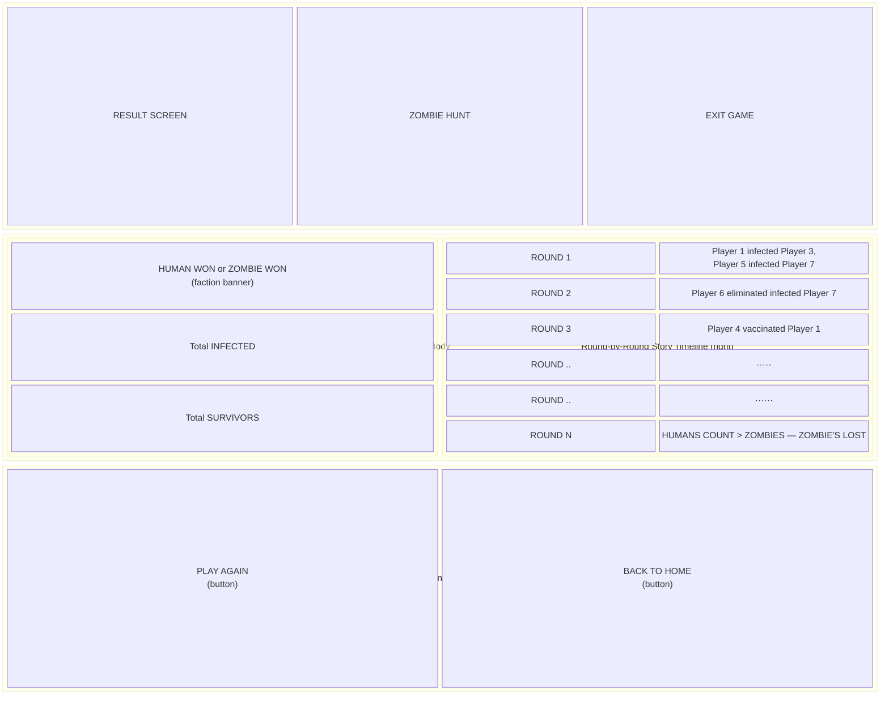

# Screen 10 — Final Result Screen

```mermaid
block-beta
  columns 1

  block:TopBar["Top Bar"]:1
    columns 3
    Label["RESULT SCREEN"]
    Title["ZOMBIE HUNT"]
    ExitBtn["EXIT GAME"]
  end

  block:Body["Body"]:1
    columns 2

    block:StatsPanel["Stats Panel (left)"]:1
      columns 1
      FactionBanner["HUMAN WON  or  ZOMBIE WON\n(faction banner)"]
      TotalInfected["Total INFECTED"]
      TotalSurvivors["Total SURVIVORS"]
    end

    block:Timeline["Round-by-Round Story Timeline (right)"]:1
      columns 2
      R1["ROUND 1"] T1["Player 1 infected Player 3,\nPlayer 5 infected Player 7"]
      R2["ROUND 2"] T2["Player 6 eliminated infected Player 7"]
      R3["ROUND 3"] T3["Player 4 vaccinated Player 1"]
      R4["ROUND .."] T4["·····"]
      R5["ROUND .."] T5["······"]
      RN["ROUND N"] TN["HUMANS COUNT > ZOMBIES — ZOMBIE'S LOST"]
    end

  end

  block:Actions["Action Row"]:1
    columns 2
    PlayAgain["PLAY AGAIN\n(button)"]
    BackHome["BACK TO HOME\n(button)"]
  end
```
